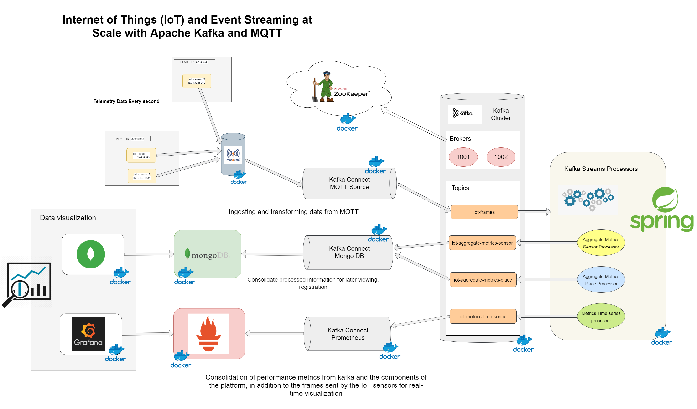

# IoT Streaming Architecture
Internet of Things (IoT) and Event Streaming at Scale with Apache Kafka and MQTT.

## Architecture Overview

The main goals of this architecture are the following:

* Ingest and store real-time data from IoT sensors located in various locations.
* Analyze and make aggregations through rotating time windows to know average temperature by sensor or place, in addition to humidity, pressure and luminosity.
* Store data after processing for subsequent monitoring in a NOSQL database with good performance for frequent writes for relatively homogeneous document sizes such as MongoDB.
* Visualization of the metrics of the sensors in real time and of the performance of the components of the architecture through Grafana and the consolidated documents in MongoDB through Mongo-Express.

## Used technology

* Spring Boot 2.3.3 / Apache Maven 3.6.3.
* Spring Boot Starter Actuator.
* Kafka Streams.
* Spring Kafka.
* Micrometer Registry Prometheus.
* Eclipse Paho MQTT Client.
* Kafka Connect.
* Kafka Rest Proxy
* lombok.
* Jackson.
* NodeExporter (Exporter for machine metrics).
* Prometheus.
* Grafana.
* Eclipse Mosquitto.
* MongoDB.
* Mongo DB Express (Web-based MongoDB admin interface, written with Node.js and express).
* Cadvisor (Analyzes resource usage and performance characteristics of running containers).
* kafka-exporter (Kafka exporter for Prometheus).

## Running Applications as Docker containers.

### Rake Tasks

The available tasks are detailed below (rake --task)

| Task | Description |
| ------ | ------ |
| check_deployment_file_task | Check Deployment File |
| check_docker_task | Check Docker and Docker Compose Task |
| cleaning_environment_task | Cleaning Evironment Task |
| deploy | Deploys the IoT Event Streaming Architecture and laun... |
| login | Authenticating with existing credentials |
| start | Start Containers |
| status | Status Containers |
| stop | Stop Containers |
| undeploy | UnDeploy IoT Event Streaming Architecture |

To start the platform make sure you have Ruby installed, go to the root directory of the project and run the `rake deploy` task, this task will carry out a series of preliminary checks, discard images and volumes that are no longer necessary and also proceed to download all the images and the initialization of the containers.

 
